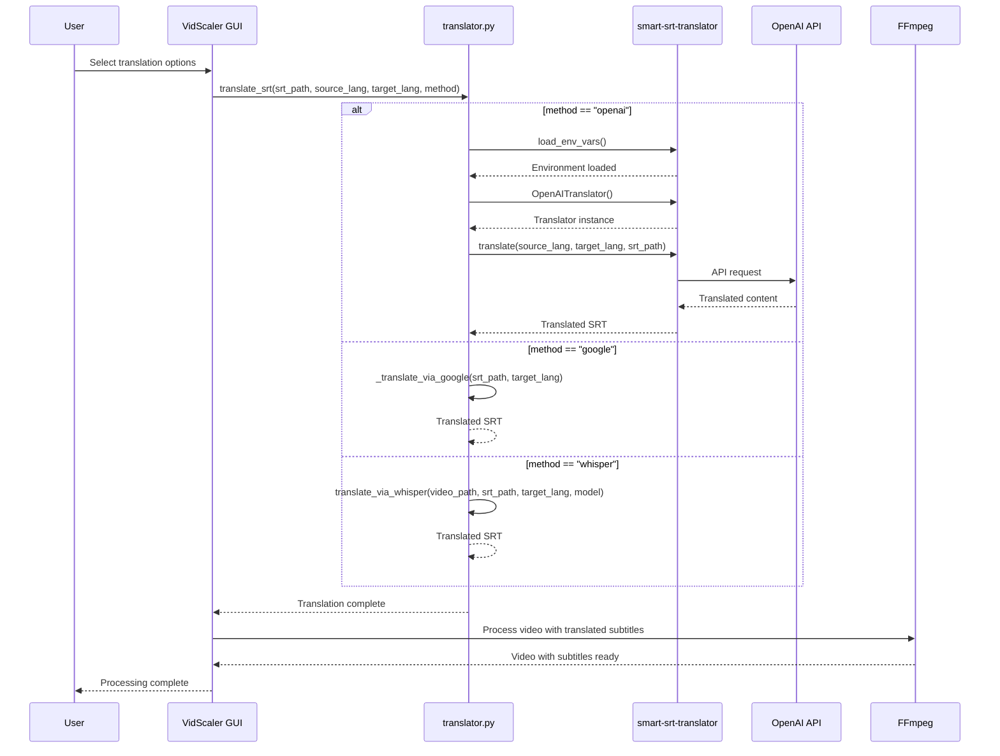

# VidScalerSubtitleAdder - Claude Development Guide

## Projektübersicht
GUI-Anwendung zum Skalieren von Videos mit FFmpeg unter Windows 11.
**✅ Phase 1 implementiert:** Untertitel-Einfügung funktioniert perfekt!

## Technische Anforderungen
- Python 3.7+ mit tkinter (standard)
- FFmpeg im System PATH
- Windows 11 kompatibel

## Setup Commands

### Virtuelle Umgebung erstellen und aktivieren (Windows):
```bash
python -m venv .venv
.venv\Scripts\activate
```

### Dependencies installieren:
```bash
pip install -r requirements.txt
```

### Anwendung starten:
```bash
python vidscaler.py
```

## Windows Batch Starter

**WICHTIG**: Das Projekt hat eine `start.bat` für einfachen Doppelklick-Start!
- ✅ Automatische Virtual Environment Aktivierung
- ✅ Startet `python vidscaler.py`
- ✅ Konsole bleibt offen für Fehlerausgaben

## Projektstruktur
```
VidScaler/
├── vidscaler.py          # Haupt-GUI-Anwendung
├── video_processor.py    # FFmpeg-Interface
├── utils.py             # Hilfsfunktionen
├── audio_transcriber.py  # Audio-zu-SRT Transkriptor mit Whisper
├── translator.py        # SRT-Übersetzungs-Engine
├── requirements.txt     # Abhängigkeiten
├── start.bat            # Windows Doppelklick-Starter
├── .venv/              # Virtual Environment
├── README.md           # Benutzeranleitung
└── CLAUDE.md          # Diese Datei
```

## Entwicklungsrichtlinien
- **Einfachheit**: Minimale Abhängigkeiten, tkinter-Standard
- **Windows-First**: Pfade mit os.path, Windows-Pfad-Handling
- **Error Handling**: Robuste FFmpeg-Fehlerbehandlung
- **Type Hints**: Für bessere Code-Qualität
- **Logging**: Für Debugging und Benutzer-Feedback

## Core Features
1. **File Selection**: Einfache Videodatei-Auswahl
2. **Resolution Display**: Aktuelle Video-Dimensionen anzeigen
3. **Smart Scaling**: Dropdown mit geraden Pixel-Werten
4. **FFmpeg Integration**: subprocess-basierte Videoverarbeitung
5. **Progress Feedback**: Status-Updates für Benutzer
6. **✅ Subtitle Integration**: .srt-Dateien unterhalb des Videos einbrennen
7. **✅ Audio Transcription**: Video → Audio → Text → SRT mit Whisper
8. **🆕 Translation Engine**: SRT-Übersetzung mit mehreren Sprachen
9. **🆕 Dual Subtitles**: Original oben, Übersetzung unten im Video

## FFmpeg Integration
**Normale Skalierung:**
- Befehl: `ffmpeg -i input.mp4 -vf scale=WIDTH:-1 output_scaled.mp4`
- Gerade Pixelwerte (durch 2 teilbar) für Kompatibilität
- Proportionale Skalierung mit -1 für Höhe

**✅ Untertitel-Integration (funktioniert perfekt):**
- Befehl: `ffmpeg -i input.mp4 -vf "scale=WIDTH:-2,pad=iw:ih+100:0:0:black,subtitles=temp_subtitles.srt" output_subtitled.mp4`
- Temporäre Datei-Kopie löst Windows-Pfad-Probleme
- Video wird um 100px nach unten erweitert
- Optimale Schriftgröße und Lesbarkeit

**🎯 Doppelte Untertitel-Integration (SRT → ASS Pipeline):**
- **SRT → ASS Konvertierung**: `ffmpeg -sub_charenc UTF-8 -i input.srt output.ass` für Style-Kontrolle
- **Asymmetrisches Padding**: 140px oben + 160px unten für optimale 2-Zeilen-Darstellung
- **Präzise Style-Parameter**: FontSize=15, Outline=2, MarginL/R=2, WrapStyle=3
- **Positioning**: Original TopCenter (Alignment=8), Übersetzung BottomCenter (Alignment=2)
- **Windows-Pfad-Fix**: Temporäre Dateien im cwd, `os.path.basename()` in FFmpeg-Filtern
- **Befehl**: `ffmpeg -i input.mp4 -vf "scale=WIDTH:-2,pad=iw:ih+300:0:140:black,ass=original.ass,ass=translated.ass" output.mp4`

## Testing Approach
- Manuelle Tests mit verschiedenen Video-Formaten
- FFmpeg-Verfügbarkeit prüfen
- Windows-Pfad-Kompatibilität testen

## Deployment
- Standalone Python-Script
- Optional: PyInstaller für .exe-Distribution

## ✅ Aktueller Status (Phase 2 ERFOLGREICH getestet!)
- **Basis-Skalierung**: ✅ Funktioniert perfekt
- **Untertitel-Einfügung**: ✅ Funktioniert perfekt - Schriftgröße optimal!
- **GUI**: ✅ Alle Controls implementiert und funktionsfähig
- **Windows-Kompatibilität**: ✅ Pfad-Probleme gelöst
- **🎉 Audio-Transkription**: ✅ LIVE GETESTET - funktioniert perfekt!

## 🆕 Phase 2 Features (Audio Transcription) - ✅ LIVE GETESTET!
- **✅ Audio Extraction**: FFmpeg extrahiert Audio aus Video (16kHz WAV)
- **✅ Whisper Integration**: OpenAI Whisper für präzise Spracherkennung - FUNKTIONIERT!
- **✅ Multi-Language**: Deutsch, Englisch, Auto-Erkennung
- **✅ Model Selection**: Tiny/Base/Small - Geschwindigkeit vs. Genauigkeit
- **✅ Segment Editor**: Timeline-basierte Text-Bearbeitung - BENUTZERFREUNDLICH!
- **✅ SRT Export**: Direkter Export zurück zur Haupt-App
- **✅ Seamless Integration**: "Audio transkribieren" Button in Haupt-GUI - PERFEKT!

## Installation (Alle Dependencies)
```bash
pip install openai-whisper matplotlib pydub translators smart-srt-translator
```

## 🎉 Phase 3 Features (Übersetzung) - ✅ PRODUKTIONSREIF!
- **✅ Übersetzungs-API**: `translators` library mit Google Translate Backend
- **✅ SRT → ASS Pipeline**: Robuste Konvertierung mit Style-Kontrolle
- **✅ Doppelte Untertitel**: Original oben, Übersetzung unten im Video
- **✅ Sprachauswahl**: Dropdowns für Quell- und Zielsprache (9 Sprachen)
- **✅ Übersetzungsmodi**: "Original + Übersetzung" oder "Nur Übersetzung"
- **✅ GUI Integration**: Übersetzungs-Sektion mit Aktivierungs-Checkbox
- **✅ Multi-Threading**: Übersetzung und Video-Verarbeitung in separaten Threads
- **🎯 Windows-Pfad-Fixes**: Alle FFmpeg-Pfadprobleme gelöst durch cwd-Temporärdateien

## 🚀 Phase 4 Features (Bidirektionale Whisper-Übersetzung) - ✅ IMPLEMENTIERT!
- **✅ WhisperTranslator-Klasse**: Audio-Extraktion + Whisper-Transkription in Zielsprache
- **✅ Smart Timing-Mapping**: Whisper-Segmente auf Original-SRT-Timing gemappt
- **✅ Triple Translation Methods**: OpenAI (beste Qualität) vs Google Translate (schnell) vs Whisper (English-only)
- **✅ GUI Method-Selection**: Dropdown mit dynamischen Whisper-Model-Optionen
- **✅ Model Caching**: Whisper-Modelle werden wiederverwendet für Performance
- **✅ Robustes Cleanup**: Automatische Bereinigung aller temporären Audio-Dateien
- **🔄 Qualitäts-Test**: Whisper-Übersetzung braucht noch Feintuning/manuelle Nachbearbeitung

## 🔄 Workflow (Phase 4)
1. **Video auswählen** → Analysieren
2. **Audio transkribieren** → SRT wird automatisch gesetzt 
3. **Übersetzung aktivieren** → Sprachen + **Methode** wählen → Modus wählen
4. **"Mit Übersetzung skalieren"** → Fertig!

## 🎉 Phase 5 Features (Production Quality & UX) - ✅ FERTIG!
- **✅ Smart-SRT-Translator Integration**: Lokales `smart_translation.py` durch PyPI-Modul ersetzt
- **✅ Optimierte GUI-Defaults**: Fenstergröße, Audio-Transkription (Base+English), Übersetzung (OpenAI+EN-Source)
- **✅ Benutzerfreundlichkeit**: Alle Standard-Einstellungen auf häufigste Use-Cases optimiert
- **✅ Modular Architecture**: Externe Dependencies über offizielle Package-Manager

## 📋 Phase 6 Roadmap (Future)
- **🎯 Translation Editor**: GUI-Fenster zum manuellen Korrigieren von Übersetzungen
- **📝 Segment-by-Segment Editing**: Wie AudioTranscriber, aber für übersetzte Texte
- **🔄 Export-Integration**: Korrigierte Übersetzung direkt in Video-Pipeline
- **⚡ Whisper-Tuning**: Bessere Prompt-Engineering für Übersetzungsqualität

## 🛠️ Technische Implementierung (Phase 3 Lösung)

### FFmpeg Windows-Pfad Problematik
**Problem:** Windows-Pfade mit Laufwerksbuchstaben (`C:\path`) verursachen Parsing-Fehler in FFmpeg-Filtern
**Lösung:** Temporäre Dateien im aktuellen Arbeitsverzeichnis + `os.path.basename()` für Filter

### SRT → ASS Konvertierungs-Pipeline
```python
def _convert_srt_to_ass(src_srt: str, dst_ass: str):
    subprocess.run([ffmpeg, "-sub_charenc", "UTF-8", "-i", src_srt, dst_ass])

def _tweak_ass_style(ass_path: str, *, alignment: int, margin_v: int, 
                     font_size: int = 15, outline: int = 2):
    # ASS V4+ Format Style-Zeile modifizieren
    # Felder: Fontsize(2), Outline(16), Shadow(17), Alignment(18), MarginV(21)
```

### Optimierte Style-Parameter
- **FontSize**: 15 (vorher 20) - kompakter für Dual-Mode
- **Margins**: L=2, R=2 (vorher 10/10) - mehr Platz für Text
- **WrapStyle**: 3 - gleichmäßigere Textumbrüche
- **Alignment**: TopCenter(8) vs BottomCenter(2)

### Video-Filter-Chain
```bash
ffmpeg -i video.mp4 -vf "
  scale=WIDTH:-2,
  pad=iw:ih+300:0:140:black,
  ass=filename=original.ass,
  ass=filename=translated.ass
" output.mp4
```

### Robustes Cleanup
```python
finally:
    for p in [temp_original_srt, temp_translated_srt, temp_original_ass, temp_translated_ass]:
        if p and os.path.exists(p):
            try: os.remove(p)
            except: pass
```

## 🛠️ Phase 4 Technische Implementierung (Whisper-Übersetzung)

### WhisperTranslator-Architektur
```python
class WhisperTranslator:
    def translate_via_whisper(self, video_path, original_srt_path, target_lang, model_size):
        # 1. Audio extrahieren (16kHz WAV für Whisper)
        # 2. Whisper-Modell laden + cachen
        # 3. Original-SRT-Timing als Referenz parsen
        # 4. Whisper in Zielsprache transkribieren
        # 5. Smart Timing-Mapping auf Original-Segmente
        # 6. Übersetzte SRT erstellen + cleanup
```

### Smart Timing-Mapping Algorithm
```python
def _map_whisper_to_original_timing(whisper_segments, original_segments):
    # Overlap-Detection: Whisper-Segment ∩ Original-Segment
    # Kombiniert alle überlappenden Whisper-Texte pro Original-Segment
    # Fallback: "[Keine Übersetzung]" wenn keine Überlappung
```

### GUI Method-Selection
- **Dynamic Widgets**: Whisper-Model-Dropdown erscheint nur bei Whisper-Auswahl
- **Dependency-Check**: Automatische Erkennung ob Whisper/Translators verfügbar
- **Smart State-Management**: Widget-States abhängig von Methoden-Auswahl

## 🏗️ Translation Architecture (Analysis by Code-Rabbit)

**Note: Architecture analysis and sequence diagram provided by Code-Rabbit AI Code Review**



This sequence diagram illustrates the translation workflow, showing how the application integrates multiple translation methods through a unified interface. The OpenAI translation path demonstrates proper provider initialization through the smart-srt-translator package, while fallback methods (Google Translate, Whisper) provide alternative translation options.