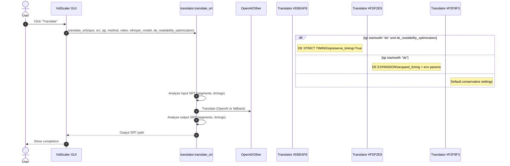

# Translation Sequence Diagram

Generated by CodeRabbit during PR review - documents the translation parameter flow and decision logic.

## Key Decision Points

1. **DE STRICT TIMING**: When `de_readability_optimization=True` + German target
   - Uses `preserve_timing=True` for video burn-in compatibility
   - May lose segments that don't fit timing constraints

2. **DE EXPANSION**: Default German mode without strict optimization
   - Uses timing expansion with environment-configurable parameters
   - Better text readability, may extend timing windows

3. **Conservative Settings**: Non-German targets
   - Standard wrap width and timing preservation
   - Minimal modifications to original timing

## Generated By
- **CodeRabbit AI Code Review**
- **Date**: 2025-09-13
- **PR**: #5 - SRT defaults and project organization